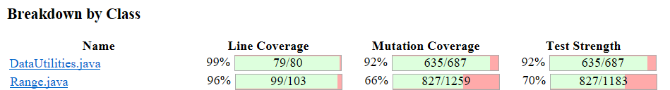
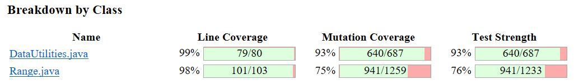

**SENG 637 - Dependability and Reliability of Software Systems**

**Lab. Report \#4 – Mutation Testing and Web app testing**

| Group 19 |
|---|
| Sami |
| Mohammad |
| Ogechukwu |
| Emmanuel |

**Table of content**


[Introduction](#introduction)

[Analysis of 10 Mutants of the Range class](#analysis-of-10-mutants-of-the-range-class)

[Report all the statistics and the mutation score for each test class](#report-all-the-statistics-and-the-mutation-score-for-each-test-class)

[Analysis drawn on the effectiveness of each of the test classes](#analysis-drawn-on-the-effectiveness-of-each-of-the-test-classes)

[A discussion on the effect of equivalent mutants on mutation score accuracy](#a-discussion-on-the-effect-of-equivalent-mutants-on-mutation-score-accuracy)

[A discussion of what could have been done to improve the mutation score of the test suites](#a-discussion-of-what-could-have-been-done-to-improve-the-mutation-score-of-the-test-suites)

[Why do we need mutation testing? Advantages and disadvantages of mutation testing](#why-do-we-need-mutation-testing-advantages-and-disadvantages-of-mutation-testing)

[Explain your SELENUIM test case design process](#explain-your-selenuim-test-case-design-process)

[Explain the use of assertions and checkpoints](#explain-the-use-of-assertions-and-checkpoints)

[how did you test each functionality with different test data?](#how-did-you-test-each-functionality-with-different-test-data)

[How the teamwork/effort was divided and managed](#how-the-teamworkeffort-was-divided-and-managed)

[Difficulties encountered, challenges overcome, and lessons learned](#difficulties-encountered-challenges-overcome-and-lessons-learned)

[Comments/feedback on the assignment itself](#commentsfeedback-on-the-assignment-itself)

# Introduction

As a continuation of the previous labs, we reinforce our test suites with mutation testing using the Pitest Eclipse plugin. It helps us analyse how well our test suite is in catching bugs and how we can try to improve it by adding more test cases that would increase the mutation score by at least 10%. Additionally, we perform GUI testing using Selenium IDE to test a few different functionalities of the Shop Smart Canada website.

> The test suite for the GUI testing can be found in the root directory and there are 4 files with the  `.side` extension

# Analysis of 10 Mutants of the Range class

We present 10 mutants analysed for the `Range` class as follows:

1. **Mutation #1** (*Replaced double operation with first member → SURVIVED*)

	This mutation was applied to the method `expand(Range range, double lowerMargin, double upperMargin)` and it changes the operation shown below

```
lower = lower / 2.0 + upper / 2.0
```
The mutant considers the first member, `lower`, for calculation effectively ignoring the intended averaging with `upper`. This mutation alters how lower is recalculated when the condition `lower > upper` is met, which originally aims to set `lower` and `upper` to their midpoint. The survival of this mutant indicates that the test suite may not specifically verify the condition where `lower` becomes greater than `upper` after expansion and that the corrective action to average `lower` and `upper` is correctly applied. To address this, additional tests would be needed to ensure that when lower is adjusted above upper the method properly recalculates both to reflect the intended averaging operation.

2. **Mutation #2** (*changed conditional boundary → SURVIVED*)

	This mutation was applied to the method `scale(Range, double)` and it tries to modify the condition by checking the `factor` variable, specifically the boundary condition for when `factor` is less than 0 (see line of code below).

```
If (factor < 0)
```
The original code checks if `factor` is less than 0 to throw an `IllegalArgumentException`, ensuring that the factor used to scale the range is non-negative. The effect of such a mutation could involve changing this boundary check, for instance, allowing negative values for `factor` or altering the strictness of the comparison (e.g., from `< `to `<=`).

Since this mutant survived, it suggests that there are no tests specifically verifying that an `IllegalArgumentException` is thrown when a negative factor is used. This oversight means that the test suite does not fully verify the method's behaviour with invalid input values. To kill this mutant, a test case should be added that passes a negative factor to the `scale` method and asserts that an `IllegalArgumentException` is thrown. This would ensure that the method's contract regarding input parameters is fully tested and any deviations from expected behaviour, as introduced by the mutation, are caught by the test suite.

3. **Mutation #3** (*not equal to greater than → SURVIVED*)

	This mutation was applied to the `equals(Object obj)` method and changed the instance check to allow incorrect non-`Range` objects. The original code ensures that `false` is returned if `obj` is not an instance of `Range` as shown in the line of code below. 

```
If (!(obj instanceof Range)
```
The effect of this mutation would imply the logical not operator is removed. The survival of such a mutant suggests the test suite may not adequately verify the type check, failing to catch scenarios where objects of incorrect types are compared. To kill the mutant, tests should assert that `equals` strictly return `false` for objects not of type `Range`.

4. **Mutation #4** (*Incremented (a++) double field lower → SURVIVED*)

	This mutation was applied to the `isNaNRange()` method, altering the `this.lower` field by attempting to increment its value before the return statement checks if both `lower` and `upper` are `NaN`. By incrementing `lower`, the mutation aims to subtly change the range's lower bound, which could impact the method's ability to report whether both bounds are `NaN` accurately. The survival of this mutant suggests the test suite may lack checks that specifically assert the immutability of `lower` in the context of `isNaNRange`, or it fails to verify that both `lower` and `upper` must be `NaN` for the method to return `true`. To effectively kill the mutant, additional tests are required that validate the method returns `false` when `lower` or `upper` is altered from `NaN` to any numerical value, thereby ensuring the integrity of the range's NaN status check.

5. **Mutation #5** (*Decremented (a--) double field lower → SURVIVED*)

	This mutation was applied to the `getCentralValue()` method which alters the `this.lower` field by attempting to decrement its value before the return statement is executed as shown in the line of code below.

```
return this.lower / 2.0 + this.upper / 2.0;
```
By decrementing `lower`, the mutation aims to subtly change the range's lower bound, which impacts the output of the `getCentralValue()` method.  It is calculated using the average of both lower and upper bounds. The survival of this mutant suggests the test suite may lack checks that specifically assert the immutability of `lower`. To effectively kill the mutant, additional tests are required that validate the method returns the lower bound with decrementing but not as expected to normally be.

6. **Mutation #6** (*Decremented (a--) double field upper→ KILLED*)

	This mutation was applied to the method `getUpperBound()` and it attempts to update the value of `this.upper` in the line of code below by post-decrementing it by 1 similar to the previous mutation #5. The effect of such mutation is that it would slightly lower the reported upper bound of a range, potentially altering the behaviour of any logic that relies on the precise value of `upper`. Because this mutant was killed, it indicates that the test suite effectively checks the accuracy of the `getUpperBound()` method. Including the exact value of the upper field and any deviation from the expected value is caught and flagged by the tests.
```
return this.upper
```

7. **Mutation #7** (*Negated double field upper→ KILLED*)

	This mutation was applied to the method `getCentralValue()` and it attempts to update the value of `this.upper` in the line of code below by negating it. The effect of such a mutation is that it would negate the reported upper bound of a range, potentially altering the behaviour of any logic that relies on the precise value of `upper`. Because this mutant was killed, it indicates that the test suite effectively checks the accuracy of the `getCentralValue()` method. The test suite contains a test case where the upper bound in zero, so negating this value would not affect the final result and we would still have a correct result for the centre value.

```
return this.lower/2.0 + this.upper/2.0
```
8. **Mutation #8** (*changed conditional boundary → SURVIVED*)

	This mutation was applied to the method `intersects(double b0, double b1)` and it alters the conditional check from `b0 <= this.lower` to a different boundary condition. The effect of such a mutation is that it could incorrectly alter the logic determining intersections, potentially causing the method to misidentify whether two ranges intersect based on their lower bounds. The survival of this mutant suggests that the test suite may not adequately cover scenarios around the lower boundary condition, failing to detect the incorrect handling of range intersection that hinges on the precise evaluation of `b0` in relation to `this.lower`.

9. **Mutation #9** (*changed conditional boundary → SURVIVED*)

	This mutation was applied to the method `shiftWithNoZeroCrossing(double value, double delta)` and it attempted to alter the conditional check from `value > 0.0` to a different boundary condition. This suggests that the mutation modifies this check to possibly ignore the operation’s outcome based on `value` and `delta`, potentially altering the logic that prevents zero-crossing shifts for positive `value`s. The original line of code ensures that when `value` is positive and being shifted, it does not cross zero due to the addition of `delta`. The survival of this mutant could indicate that the test suite does not adequately verify the method’s behaviour where `value` is close to zero or `delta` is negative. To effectively address this, additional tests are needed to cover cases near the boundaries of zero-crossing to ensure the method correctly handles shifts for both positive and negative `value`s.

10. **Mutation #10** (*removed conditional - replaced comparison check with false → SURVIVED*)

	This mutation was applied on the method `shiftWithNoZeroCrossing(double value, double delta`) by altering the conditional check `else if (value < 0.0)` to effectively always evaluate as false. This change prevents the method from correctly applying logic intended for scenarios where `value` is negative. The effect of this mutation is that it could cause the method to improperly handle shifts for negative values, possibly allowing them to cross into positive territory. This mutation surviving indicates that the test suite may lack tests specifically designed to verify that shifts do not result in zero crossing from negative to positive values. It can be addressed with test cases where `value` is negative and `delta` is varied (particularly where `delta` could cause a zero crossing if not properly handled).

# Report all the statistics and the mutation score for each test class

Having analysed the mutants for the `Range` class, we proceed to discuss the mutation score and statistics of both the `Range` and `DataUtilities` class for which the test suite was designed from the last labs. We present the mutation score and statistics given by Pitest before and after adding more test cases.

## Mutation Score and Statistics with original test suite



*Mutation score of the `Range` and `DataUtilities` classes given by Pitest eclipse extension*

The achieved mutation scores for the `Range` and `DataUtilities `in the original test suite from the previous lab as given in the figure above are 66% and 92% respectively. The mutation statistics are shown in the tables below.

*Mutation statistics of the `Range` class*

| Method | Survived | Killed | Total |
|---|---|---|---|
| `Range()` | 19 | 33 | 52 |
| `Range.getLowerBound()` | 0 | 7 | 7 |
| `Range.getUpperBound()` | 0 | 7 | 7 |
| `Range.getLength()` | 0 | 19 | 19 |
| `Range.getCentralValue()` | 4 | 43 | 47 |
| `Range.contains(double)` | 6 | 47 | 53 |
| `Range.intersects(double, double)` | 43 | 63 | 106 |
| `Range.intersects(Range)` | 0 | 6 | 6 |
| `Range.constrain(double)` | 31 | 43 | 74 |
| `Range.combine(Range, Range)` | 4 | 29 | 33 |
| `Range.combineIgnoringNaN(Range, Range)` | 18 | 68 | 86 |
| `Range.min(double, double)` | 31 | 25 | 56 |
| `Range.max(double, double)` | 16 | 40 | 56 |
| `Range.expandToInclude(Range, double)` | 14 | 53 | 67 |
| `Range.expand(Range, double, double)` | 65 | 69 | 134 |
| `Range.shift(Range, double)` | 7 | 7 | 14 |
| `Range.shift(Range, double, boolean)` | 9 | 53 | 62 |
| `Range.shiftWithNoZeroCrossing(double, double)` | 55 | 54 | 109 |
| `Range.scale(Range, double)` | 12 | 38 | 50 |
| `Range.equals(Object)` | 9 | 64 | 73 |
| `Range.isNaNRange()` | 14 | 29 | 43 |
| `Range.hashCode()` | 71 | 12 | 83 |
| `Range.toString()` | 4 | 18 | 22 |
| **Total** | **432** | **827** | **1259** |

*Mutation Statistics for the `DataUtilties` class*

| Methods | Survived | Killed | Total |
|---|---|---|---|
| `DataUtilities.equal(double[][], double[][])` | 8 | 94 | 102 |
| `DataUtilities.clone(double[][])` | 2 | 60 | 62 |
| `DataUtilities.calculateColumnTotal(Values2D, int)` | 5 | 62 | 67 |
| `DataUtilities.calculateColumnTotal(Values2D, int, int[])` | 10 | 81 | 91 |
| `DataUtilities.calculateRowTotal(Values2D, int)` | 5 | 62 | 67 |
| `DataUtilities.calculateRowTotal(Values2D, int, int[])` | 10 | 81 | 91 |
| `DataUtilities.createNumberArray(double[])` | 3 | 35 | 38 |
| `DataUtilities.createNumberArray2D(double[][])` | 1 | 43 | 44 |
| `DataUtilities.getCumulativePercentages(KeyedValue)` | 8 | 117 | 125 |
| **Total** | **52** | **635** | **687** |

## Mutation Score and Statistics with improved test suite



*Mutation score of the `Range` and `DataUtilities` classes given by Pitest eclipse extension*

With the improved test suite, we increase the mutation scores for the `Range` and `DataUtilities` to 75% and 93% respectively as shown in the figure above. The new mutation statistics are shown in the tables below.

*Mutation statistics of the `Range` class*

| Method | Survived | Killed | Total |
|---|---|---|---|
| `Range()` | 19 | 33 | 52 |
| `Range.getLowerBound()` | 0 | 7 | 7 |
| `Range.getUpperBound()` | 0 | 7 | 7 |
| `Range.getLength()` | 0 | 19 | 19 |
| `Range.getCentralValue()` | 0 | 47 | 47 |
| `Range.contains(double)` | 6 | 47 | 53 |
| `Range.intersects(double, double)` | 43 | 63 | 106 |
| `Range.intersects(Range)` | 0 | 6 | 6 |
| `Range.constrain(double)` | 31 | 43 | 74 |
| `Range.combine(Range, Range)` | 4 | 29 | 33 |
| `Range.combineIgnoringNaN(Range, Range)` | 18 | 68 | 86 |
| `Range.min(double, double)` | 31 | 25 | 56 |
| `Range.max(double, double)` | 16 | 40 | 56 |
| `Range.expandToInclude(Range, double)` | 13 | 54 | 67 |
| `Range.expand(Range, double, double)` | 16 | 118 | 134 |
| `Range.shift(Range, double)` | 7 | 7 | 14 |
| `Range.shift(Range, double, boolean)` | 9 | 53 | 62 |
| `Range.shiftWithNoZeroCrossing(double, double)` | 55 | 54 | 109 |
| `Range.scale(Range, double)` | 5 | 45 | 50 |
| `Range.equals(Object)` | 9 | 64 | 73 |
| `Range.isNaNRange()` | 14 | 29 | 43 |
| `Range.hashCode()` | 24 | 59 | 83 |
| `Range.toString()` | 4 | 18 | 22 |
| **Total** | **318** | **941** | **1259** |

*Mutation Statistics for the `DataUtilties` class*

| Methods | Survived | Killed | Total |
|---|---|---|---|
| `DataUtilities.equal(double[][], double[][])` | 8 | 94 | 102 |
| `DataUtilities.clone(double[][])` | 1 | 61 | 62 |
| `DataUtilities.calculateColumnTotal(Values2D, int)` | 5 | 62 | 67 |
| `DataUtilities.calculateColumnTotal(Values2D, int, int[])` | 9 | 82 | 91 |
| `DataUtilities.calculateRowTotal(Values2D, int)` | 5 | 62 | 67 |
| `DataUtilities.calculateRowTotal(Values2D, int, int[])` | 9 | 82 | 91 |
| `DataUtilities.createNumberArray(double[])` | 1 | 37 | 38 |
| `DataUtilities.createNumberArray2D(double[][])` | 1 | 43 | 44 |
| `DataUtilities.getCumulativePercentages(KeyedValue)` | 8 | 117 | 125 |
| **Total** | **47** | **640** | **687** |

# Analysis drawn on the effectiveness of each of the test classes

The mutation score and statistics of the original test suite show a good enough check and high test strength. This again demonstrates the team's effort to meet good coverage metrics in the previous lab. In addition, it was observed that a good number of surviving mutants were due to equivalent mutants. Thus, in reality, very little could be done to improve the mutation scores.

However, the improved test suite managed to satisfy the requirement of a minimum of 10% improvement in the `Range` class as the `DataUtilities`` `has a near-perfect score from the original test suite.

# A discussion on the effect of equivalent mutants on mutation score accuracy

By definition, equivalent mutants are the mutants that represent a syntactic variation of the program’s source code, however, the behaviour of the mutant is indistinguishable from the original program’s behaviour for all possible inputs, thereby making them “equivalent” to the original. To demonstrate the effect of these equivalent mutants, we present some of them encountered and how they affect the mutation score accuracy.

1. **Equivalent Mutation #1** (*Less than to not equal → SURVIVED*)

This mutation was applied to the `createNumberArray(double [])` method of the `DataUtilities` class. It affected the `for` loop as shown in the line of code below.

```
for(int i = 0; i < data.length; i++)
```
The condition for the index `i` has changed from `i < data.length` to `i! = data.length`. This change did not affect the result of the method because the loop will be broken at the same step under either condition, so this mutant is considered an equivalent mutant. The effect of such a mutation is that despite its occurrence, it cannot be killed and limits the highest mutation coverage achievable.

**This equivalent mutant also exists in the **`createNumberArray2D(double [][]).`

2. **Equivalent Mutation #2** (*Incremented (a++) double local variable number 7 → SURVIVED*)

This mutation was applied to the `expand(Range, double, double)` method of the `Range` class and it involves incrementing a local variable, presumably after the calculation of the `lower` value as shown in the line of code below

```
lower = lower / 2.0 + upper / 2.0
```
This particular line is intended to adjust `lower` to the midpoint between the original `lower` and `upper` values when `lower` mistakenly exceeds `upper` after applying the margins. Incrementing a variable right after setting it to a calculated value would not change the method’s behaviour from an external viewpoint. The adjusted `lower` value is immediately overwritten with a value that does not depend on the incremented value and `upper` is set to be equal to `lower` immediately afterwards. Again, the effect of such a mutation is that despite its occurrence, it cannot be killed and limits the highest mutation coverage achievable.

# A discussion of what could have been done to improve the mutation score of the test suites

For this lab, our strategy was created from the objectives surrounding the tasks in the lab which is to create test cases that help improve the mutation score of the methods of the `Range` and `DataUtilities` class. As such, the first step in our strategy was to understand the mutation testing tool and understand how to analyse and interpret the results. With that stage complete, we moved on to divide the tasks based on the familiarization of the team members with the method in question. With a scrutinized examination of the surviving mutants, we decided to either enhance existing or add more test cases to reduce the number of surviving mutants and similarly uncover equivalent mutants. The methods that were treated are listed in the teamwork section for both classes.

# Why do we need mutation testing? Advantages and disadvantages of mutation testing

Mutation testing is a valuable technique in software testing that involves making small changes to the source code (mutations). This creates faulty versions in the program also known as mutants. The mutant is then tested against the original test suite, to identify whether the test suite can differentiate between the correct behaviour of the original program and the faulty behaviours introduced by the mutants.

**Advantages:**

1. Effectiveness in evaluating test Suite Quality: The rigorous testing measures the effectiveness of the test suite. It helps determine the extent to which the test suite can detect faults in the software program. High mutation scores show that the test suite is robust and capable of identifying a wide range of potential defects.

2. Detection of Weakness in Test Suite: It is used to detect weakness in the test suite coverage. By evaluating the ability to detect faults. It exposed the areas in the code that are not effectively tested, thus allowing developers to improve the test coverage in those areas.

3. Quality improvements of test case: Mutation testing encourages development to write more thorough and improved testing. It enables developers to consider edge cases, boundary and error scenarios in the software and make it more robust and improved techniques.

4. Early Detection of Defect: Mutation testing can be integrated into the software development process, allowing defects to be identified and addressed early in the development lifecycle. This can ultimately reduce the cost and effort associated with fixing defects later in the development process in production.

**Disadvantages:**

1. Computational complexity: Mutation testing can be computationally expensive, for large codebases or complex programs. This can generate mutants and running them against the test suite can require significant computational resources and time making it impractical for some projects.

2. High False Positive Rate: Mutation testing can produce a high number of false positives where mutants are killed even though they do not represent a real fault in the program. This can occur if the test suite is overly strict or the mutations introduced need to be more complex to realistically represent potential defects.

3. Dependency on Test Oracles: It depends on the availability of reliable test oracles to determine whether a mutant has been killed. If the test oracles are not comprehensive and accurate, it can lead to inaccurate mutation scores and a false sense of security about the quality of the test suite.

4. Limited Mutation Operators: In most cases, the effectiveness of the mutation testing depends mostly on the quality and diversity of the mutation operators used to generate the mutants. If the mutation operations are limited, mutation testing may fail to identify certain types of faults in the software program.

# Explain your SELENUIM test case design process

We chose the Shop Smart Canada website as our SUT. The test case design process occurred as follows:

1. First, we downloaded Selenium on our browser, we tried both Chrome and Firefox with the different SUT options provided in the assignment. Eventually, we chose to use Firefox because the record and replay process was more difficult and slower on Chrome compared to Firefox. We also chose the Shop Smart Canada website as SUT because it contained many functionalities and was the website with the most varied types of products.

2. After choosing the SUT, we investigated the website to determine the functionalities that could be tested. We chose the most prominent and crucial functionalities that are usually important in a shopping website (Login, Shopping cart, Navigating, Searching, etc,.).

3. After deciding the functionalities to be tested, we performed them before testing to see the expected results and check if there were any pre-requirements.

4. Afterwards, we made sure we met all the pre-requirements, e.g. signing up with a valid account so we could test the login functionality. We signed up with an email, password, and personal information (first name, last name, address, …), this account was used by all of us for individual testing later on.

5. We investigated where to put verification and assertion points, and the different types of test data that could be used.

6. Then, we started testing by using the record and replay (playback) with Selenium.

7. We recorded the tests and made sure to use all different types of test data. We also added as many verification and assertion points as possible. We made sure that the results were correct and as expected to be.

8. Then, we played the record to check that the test was smooth and all the cases were checked and performed correctly.

9. We recorded back all the tests that had problems with their recordings. Some were discontinued and stopped playing because of different reasons (We will mention them as defects later in the report).

10. Afterwards, we deleted any unnecessary steps like mouse over, mouse move, etc, that did not affect the testing process of the designated functionality.

11. Finally, we played the record, made sure it was working correctly and saved the tests as JUnit test files.

| The Tested Functionality | Definition of the Functionality |
|---|---|
| Login Functionality | Testing the login process, where we try to log in using valid and invalid credentials. |
| Add Item Functionality | Testing the ability to add an item to the shopping cart, modifying this item, and then deleting the content of the cart. |
| Search Functionality | Testing the search process by using the search bar on the website. We try to search for some products and then modify the search to get other results. |
| Tab Navigation Functionality | Testing the ability to smoothly navigate through the multiple tabs on the website. We try to navigate from one to another and check that no problem occurs during the transmission. |
| Sorting Options Functionality | Testing the sorting options on the website. We choose a list of products and then try to sort them according to price, new addition, etc. We also changed the layout that the products are shown according to. |
| Subscription Functionality | Testing the subscription process where we subscribe to the website using the email we signed up with. |
| Profile Settings Functionality | Testing the settings of the profile where we check the personal information and the ability to change this information. |
| Wishlist Functionality | Testing the ability to add an item to the wish list and then delete this item. |

# Explain the use of assertions and checkpoints

We used different types of assertions and checkpoints in each of the test cases.

| The Assertion or Checkpoint | The Usage of the Assertion or Checkpoint |
|---|---|
| Verify Element Present | To verify if an item (Button, Text Boxes, Labels, Lists, etc.) is present or not in the GUI. We aimed to make sure that a shown item on the GUI, really exists. |
| Verify Text | To check if a certain element text exists on the GUI. |
|  Assert Text | To check if a certain element text exists on the GUI. The difference between this assertion and the Verify Text is that Assertion Text is more assertive. It will interrupt the test if the text element does not exist, while the Verify Text continues. Therefore, we used Assert Text with what appeared to be crucial texts, and to have different kinds of assertions as well. |
| Verify Editable | To check if the content of a text box can be changed or deleted. |

The assertions or checkpoints used in each test case were as follows:

| The Tested Functionality | The Assertion or Checkpoint used | The Reason for Using This Assertion or Checkpoint |
|---|---|---|
| Login Functionality | Verify Element Present | Verifying the presence of the login and logout labels, the text boxes of email address and password, and the login button. |
|  | Assert Text | Asserting the texts of signup, and the message we receive when entering invalid or empty credentials. |
|  | Verify Editable | Verifying that we can edit the text boxes of the email address and password. |
| Add Item Functionality | Verify Element Present | Verifying the presence of the ADD TO CART button. |
|  | Assert Text | Asserting the text that says “Your cart is empty” |
| Search Functionality | Verify Element Present | Verifying the presence of the search bar, the submit button, the SEARCH button, the PREFERENCE list, and the price text boxes. |
|  | Verify Text | Verifying the text of the preference chosen from the PREFERENCE list. |
|  | Verify Editable | Verifying that we can edit the content of search bars and price text boxes. |
| Tab Navigation Functionality | Verify Element Present | Verifying the presence of some tabs. |
|  | Verify Text | Verifying the names of some tabs. |
| Sorting Options Functionality | Verify Element Present | Verifying the presence of the secondary tabs, SORT BY buttons, and DISPLAY BY buttons. |
|  | Verify Text | Verifying the names of the secondary tabs.  |
| Subscription Functionality | Verify Element Present | Verifying the presence of the email address text box and the SUBSCRIBE button. |
|  | Verify Text | Verifying the message text shown when entering an email address or keeping the text empty. |
|  | Verify Editable | Verifying that we can edit the content of the email address text box. |
| Profile Settings Functionality | Verify Element Present | Verifying the presence of some tabs in the profile page, the EDIT button under ADDRESS tab, and the SAVE ADDRESS button. |
|  | Verify Text | Verifying the text of some tabs on the profile page. |
|  | Verify Editable | Verifying the ability to edit the content of the Address Line 1 text box. |
| Wishlist Functionality | Verify Element Present | Verifying the presence of the ADD TO WISH LIST button and the REMOVE ITEM button. |
|  | Assert Text | Asserting the content of the message “Your Wish List is empty. When you add items to your Wish List they will appear here.” |

# how did you test each functionality with different test data?

We tried to use as much test data as possible in our test cases. For some test cases, it was not possible to use different test data, so only some of our test cases were performed with varied test data.

| The Tested Functionality | Types of The Used Test Data |
|---|---|
| Login Functionality | We used valid and invalid accounts. We entered the incorrect email address and password, the correct email with the incorrect password, the incorrect email address with the correct password, and finally, the correct email address and password. We also tried to log in using empty credentials. |
| Search Functionality | We searched using the name of an existent product “fridge”. We also entered a nonexistent product “air fryer”, the product is maned “air fryer”. By searching for something that is non-existent, we tested the recommendation the website gives for products similar to what the user is looking for. |
| Subscription Functionality | We subscribed using the valid email address we signed up with. We also entered an invalid email address to see the behaviour of the website, and it did not give back any error. We also tried with empty content as an email address and received a warning message to enter a valid email address. |
| Profile Settings Functionality | We changed the personal information using letters, numbers, and spaces. We entered a nonexistent address, and it did not give back any errors. |

For the other functionalities, it was not possible to use different test data because the test cases only contained interactions with the GUI; there was no input from the user, just clicking and observing.

# How the teamwork/effort was divided and managed

As the lab is a continuation of the previous labs, we divided the task based on past familiarization and the strengths of the team members. Teamwork has always been highly encouraged in the team, so everyone participated in analysing the mutants and developing test cases to kill them if they were not equivalent mutants. However, if equivalent mutants were encountered the team member whose analysis uncovered the mutants is responsible for documenting the information in the lab report. Daily their contributions were compiled to determine if the overall metric of done (at least a 10% increase in the mutation score) had been reached. The summary of the team-assigned duties is summarised in the table below.

Table 1: task assignment for each of the team members for mutation testing

| Team Member | Methods Under Test | Additional Duties |
|---|---|---|
| Sami Abdelhalem | org.jfree.data.Range.contains<br/>org.jfree.data.Range.intersects<br/>org.jfree.data.Range.constrain<br/>org.jfree.data.Range.shift<br/>org.jfree.data.Range.shiftWithNoZeroCrossing<br/>org.jfree.data.DataUtilities.getCumulativePercentages |  |
| Mohammad Hallaq | org.jfree.data.Range.getCentralValue<br/>org.jfree.data.DataUtilities.clone<br/>org.jfree.data.DataUtilities.createNumberArray |  |
| Ogechukwu Kanu | org.jfree.data.Range.expand<br/>org.jfree.data.Range.scale<br/>org.jfree.data.Range.equals<br/>org.jfree.data.Range.isNaNRange<br/>org.jfree.data.Range.hashCode<br/>org.jfree.data.Range.toString<br/>org.jfree.data.DataUtilities.calculateColumnTotal<br/>org.jfree.data.DataUtilities.calculateRowTotal | Compilation of improved test suite and generation of PIT  mutation score, review and finalization of lab report |
| Emmanuel Alafonye | org.jfree.data.Range.combine<br/>org.jfree.data.Range.combineIgnoringNaN<br/>org.jfree.data.Range.expandToInclude<br/>org.jfree.data.DataUtilities.createNumberArray2D |  |

For the second part of the lab, the GUI testing, each of the team members handled two functionalities of the Shop Smart Canada website using the Selenium IDE browser extension.

Table 2: task assignments for each member of the team for the GUI testing

| Team Member | Functionality Tested | Additional duties |
|---|---|---|
| Sami Abdelhalem | Sorting Options Functionality<br/>Subscription Functionality |  |
| Mohammad Hallaq | Login Functionality<br/>Add Item Functionality | Signing up with a valid email address and filling up some personal information. |
| Ogechukwu Kanu | Search Functionality<br/>Tab Navigation Functionality |  |
| Emmanuel Alafonye | Profile Settings Functionality<br/>Wishlist Functionality |  |

# Difficulties encountered, challenges overcome, and lessons learned

Some of the challenges encountered were related to the use of mock data in the test suite which like in the previous lab gave problems due to the updated version of its dependency, the `hamcrest` library. Like in the previous lab, it was fixed by using a lower version (v1.1) instead of (v1.3). Another challenge was resolving the failed test with the latest codebase for the JFreeChart program (SUT). We resolved it by changing the assertion exceptions and commenting fails that could not be resolved thereby reducing the test cases from a total of 132 to 129.  

Regarding the GUI testing, we faced some difficulties while performing record and replay with Selenium. The problem is that the test can fail if done previously on random or temporary items on the website. More specifically, if we want to add a product that appears on the first page of the website as a Spring sale to our shopping cart, the test will fail later when we replay it because the item could disappear from the website, at the end of Spring Sale. Therefore, we had to choose to test some permanent items and products that could probably last for a long period after finishing recording the test. For example, for the Wishlist functionality, we chose to add a best-selling product from the SUMMER PRODUCTS because we thought it would stay on the website for an adequate period after recording the test.

Moreover, Selenium does not perform well with Pop-ups, the recorded test does not recognize those pop-ups used while recording. Therefore, we had to ensure that we performed our tests by moving to another website page rather than having a pop-up.

These problems had us recording the same test several times to make sure it had not failed and could be replayed very well.

# Comments/feedback on the assignment itself

The lab report provides a thorough and detailed analysis of mutation testing applied to the `Range` and `DataUtililies` classes, as well as the GUI testing using Selenium for the Shop Smart Canada website. The report demonstrates a comprehensive understanding of mutation testing principles, including identification and analysis of mutant interpretation of mutation scores and strategies for improving test suites. The division of tasks among team members for both mutation testing and GUI testing appears to be well-organized ensuring that each member contributes effectively to the overall project. The inclusion tables; specify assigned tasks.

The analysis of equivalent mutants and their impact on mutation score is insightful hilging the importance of distinguishing between equivalent and non-equivalent mutants to accurately asses test suie effectiveness. The Selenium test case design process is clear and methodical providing a step-by-step overview of the team approach to the testing functionality.

In terms of feedback on the assignment itself, it appears comprehensive and well-structured. One suggestion for improvement could be to provide more detailed insights into specific defects encountered during GUI testing and how they were addressed. Additionally, incorporating a section on future recommendations or areas for further improvement could enhance the completeness of the report
